<h1>📓 Fullstackopen project - Journal App 📝</h1>

> Create journals/notes to different locations all over the world 🌍

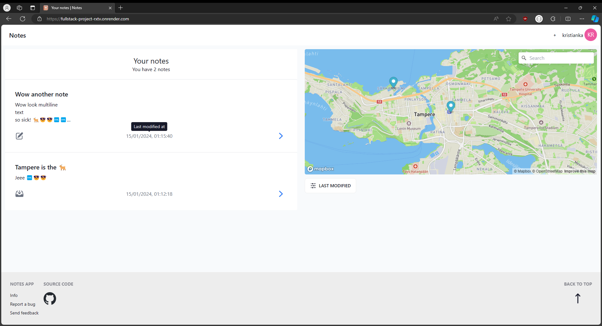

❓ This is the repository for my fullstack project Journal app which took over 200 hours to make! This readme includes the documentation, the code for the frontend and the backend. See below for more screenshots and info.

💻 Deployed at https://fullstack-project-rxtv.onrender.com/. You can use any email to register, it isn't verified. For demo purposes you can use for example `mail@example.com` and password `password123`.

⭐ New! I have made a React Native port of this app, see here! https://github.com/kristianka/journal_app

<h1>Info</h1>

<h2>Technologies used 🔧</h2>

All the code in frontend and backend are made with TypeScript and with latest libraries and standards.

<h3>Frontend</h3>

-   Frontend powered by React, Vite, Tailwind. Multiple components from like Daisy UI, Preline, Flowbite.

-   Routing by React Router, state management by Tanstack Query (React Query).

-   Map powered by Mapbox.

-   User authentication powered by Firebase Authentication.

-   Automated testing powered by Cypress. Every page and major function has a E2E test.

<h3>Backend</h3>

-   Backend powered by NodeJS & Express. Database powered by MongoDB and hosted by Mongo Atlas.

-   Automated testing powered by Cypress. API testing done manually with Hoppscotch.

<h2>Main features ⭐</h2>

-   Create user / login with Firebase Authentication. You can reset password if forgotten.

-   Frontpage has a list of all notes and a map that has pins to notes' locations.

-   Create notes that have title, content and location. You can search for an address or drop a pin to the map.

-   Edit and delete notes.

-   Change your name or delete your account.

-   Set default map location for your notes.

-   The app is designed for all screens, UI scales properly on mobile and PC.

<h2>Screenshots 📷</h2>

Frontpage
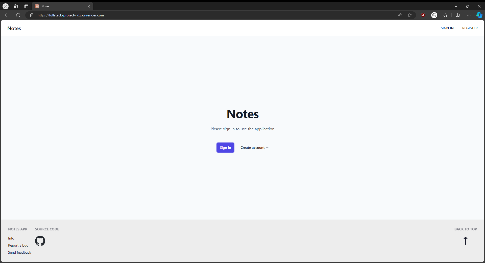

Sign in page
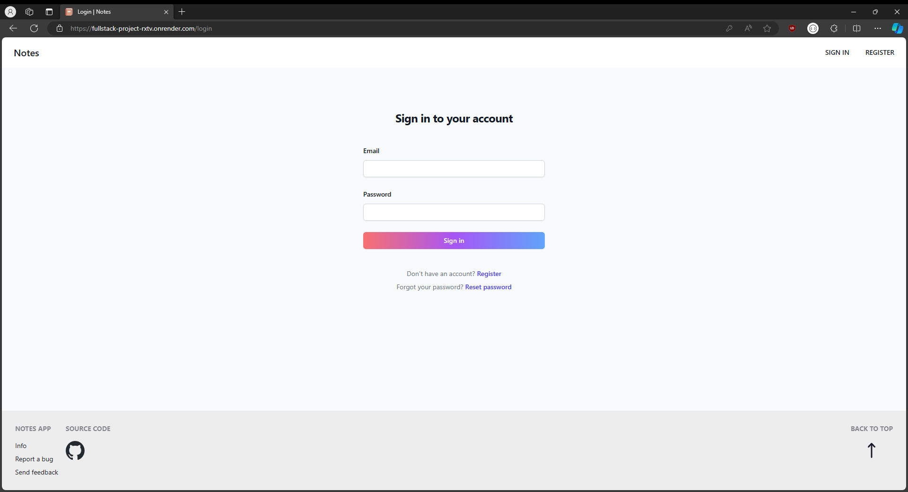

Register page
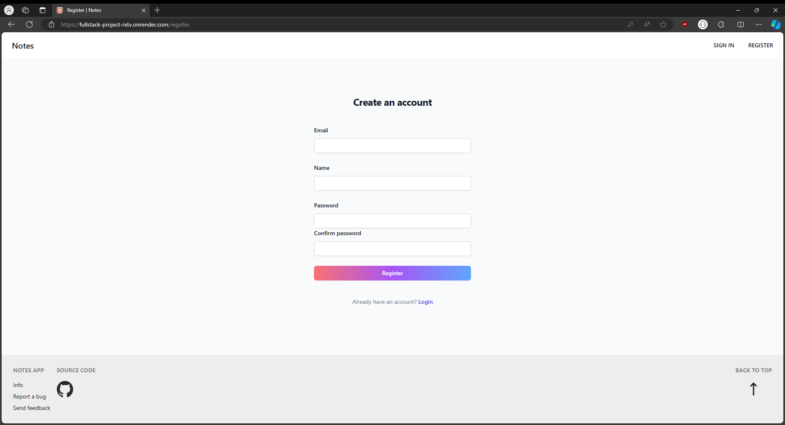

Frontpage after creating user / signing in
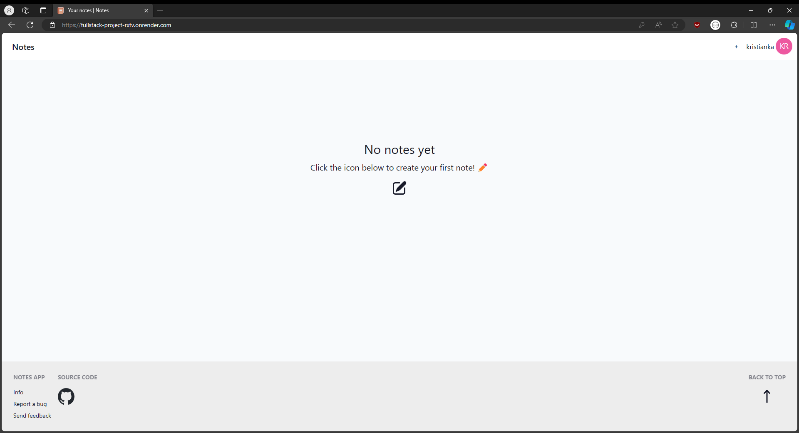

Adding a note
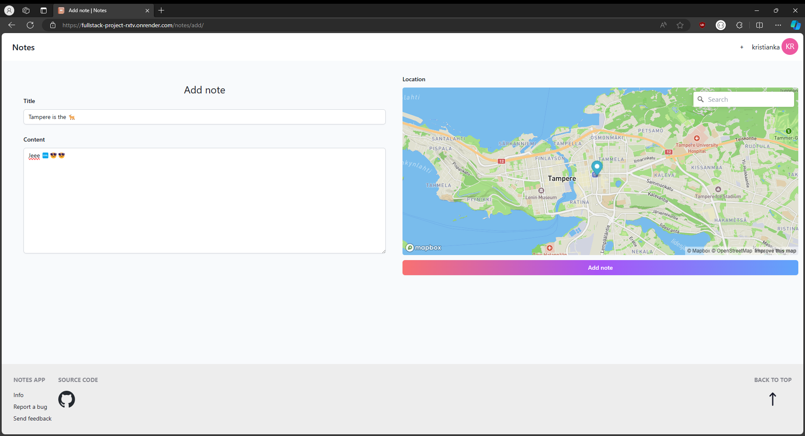

Adding a note on mobile / small screens (scrollable)

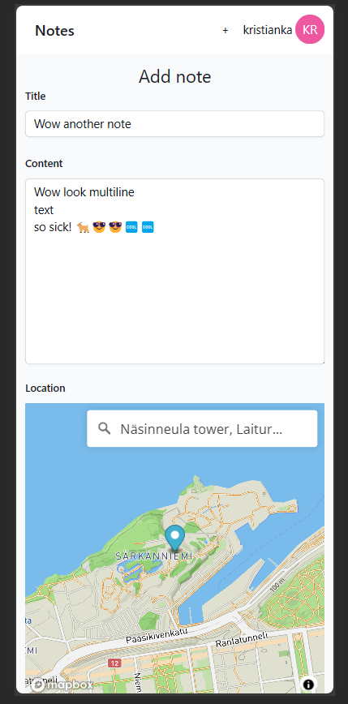

Single note view
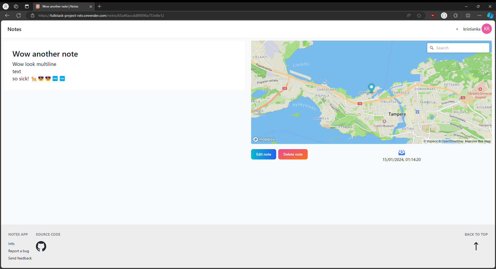

Editing note
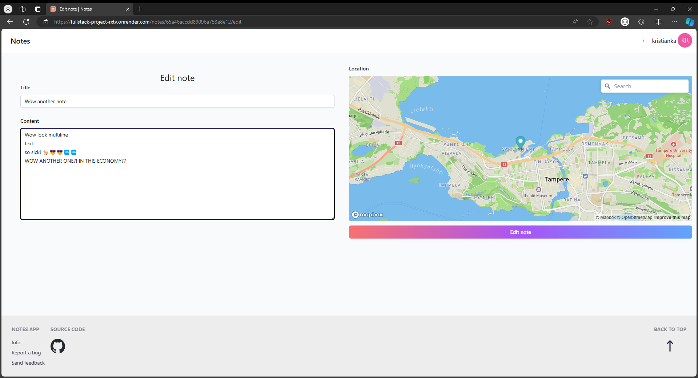

Frontpage after two notes

Frontpage loading skeleton
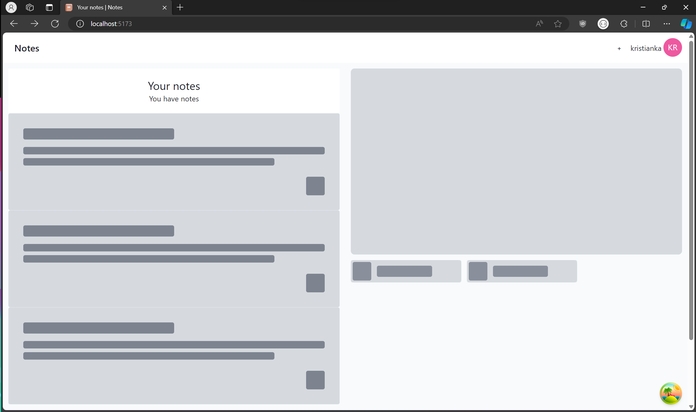

Profile page
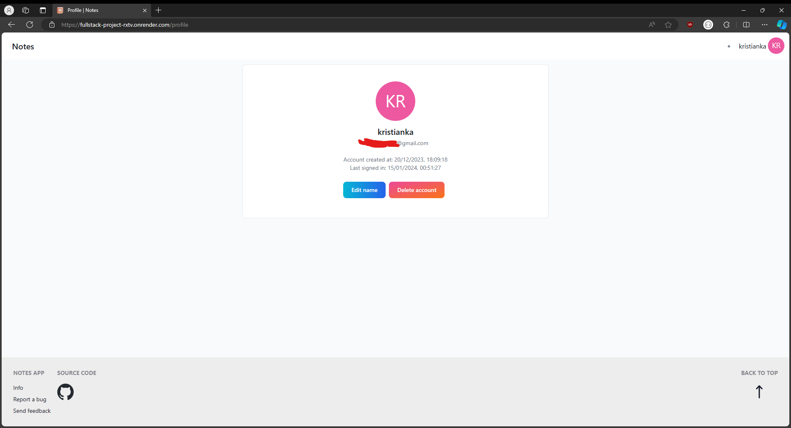

Changing name
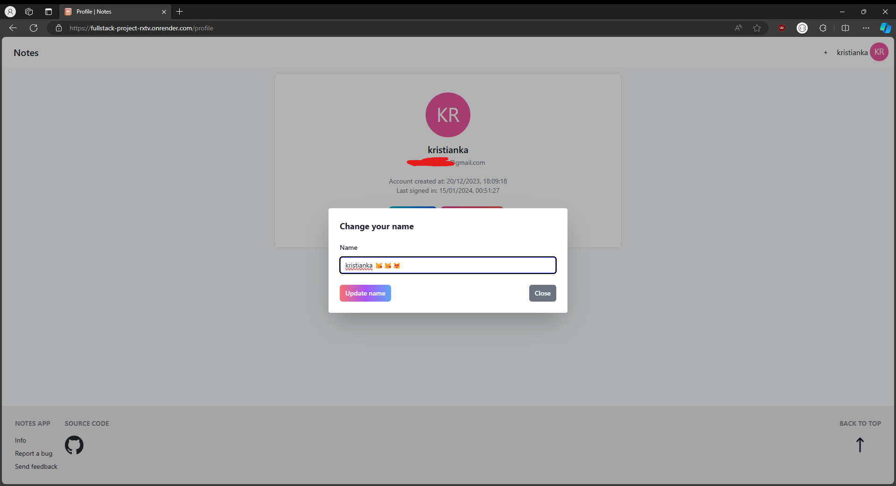

Settings page
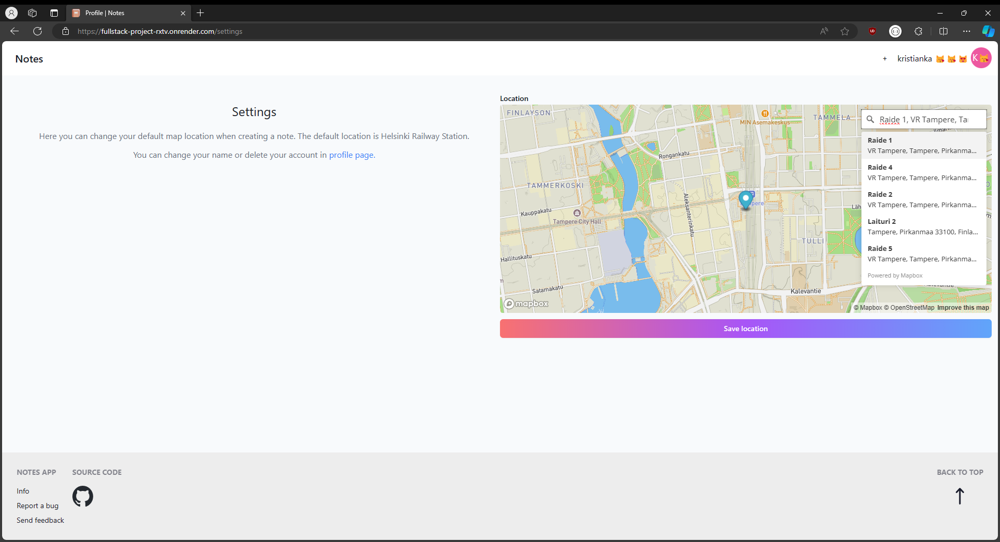

Info page
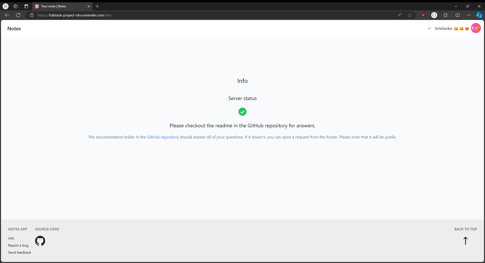

<h2>Running the app 🏃</h2>

This project has three different Firebase Auth and MongoDB credentials: development, testing and production.

See [here](./documentation/running.md) for information how to run.

<h2>Test coverage 🔬</h2>

This project uses Cypress for E2E testing. Almost every aspect has a E2E test, excluding some map elements where automated testing isn't possible due to Mapbox's limitations.

Backend has been throughly tested with Hoppscotch when changes have been made to it. Automated testing seems to be impossible due to auth being handled by Firebase Auth and you need your ID and token for every request.

See [here](./frontend/cypress/e2e/test.cy.ts) for tests.

<h2>Time used ⏱️</h2>

See [here](./documentation/timetable.md).

<h2>What I learned and thoughts about the project 🎓</h2>

See [here](./documentation/afterthoughts.md).

<h2>Bug reports and other 🐛</h2>

Please open a GitHub issue [here.](https://github.com/kristianka/fullstack-project/issues)
